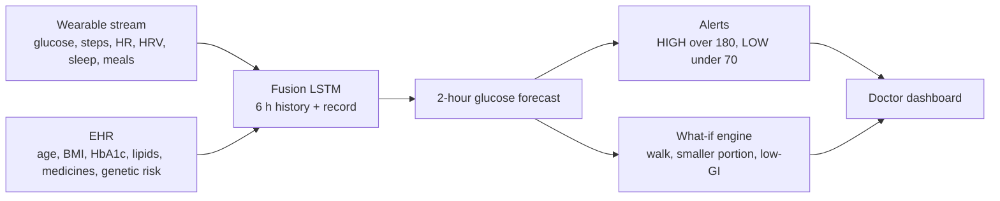
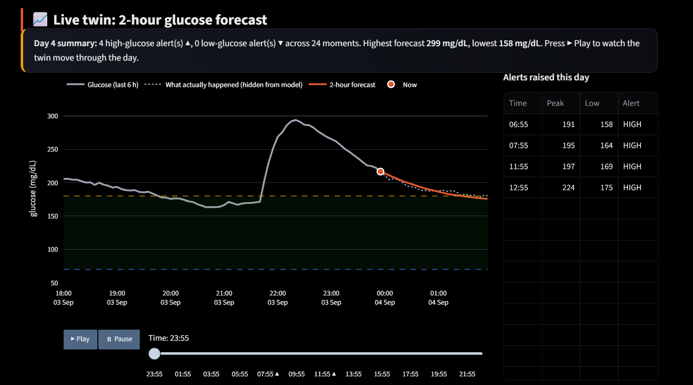
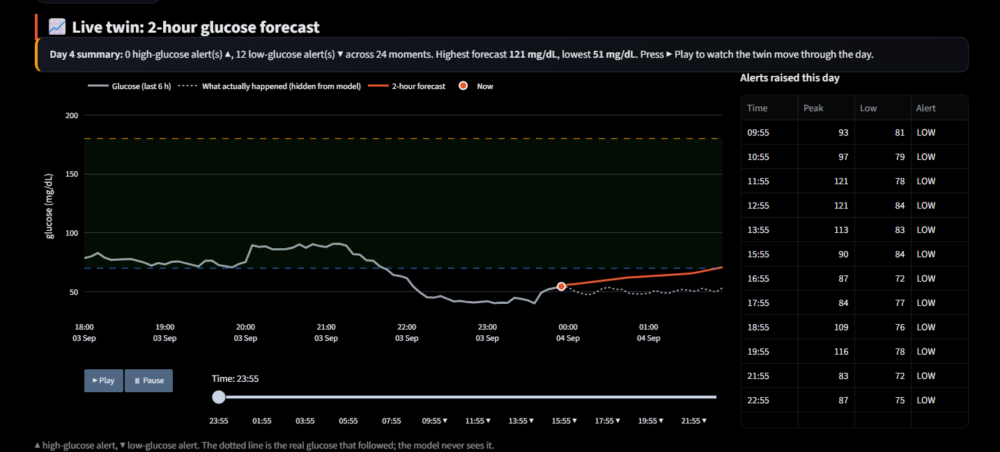
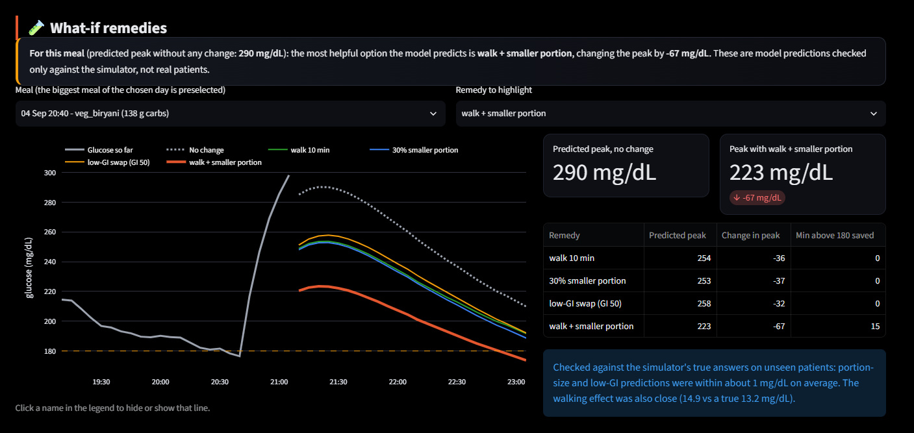
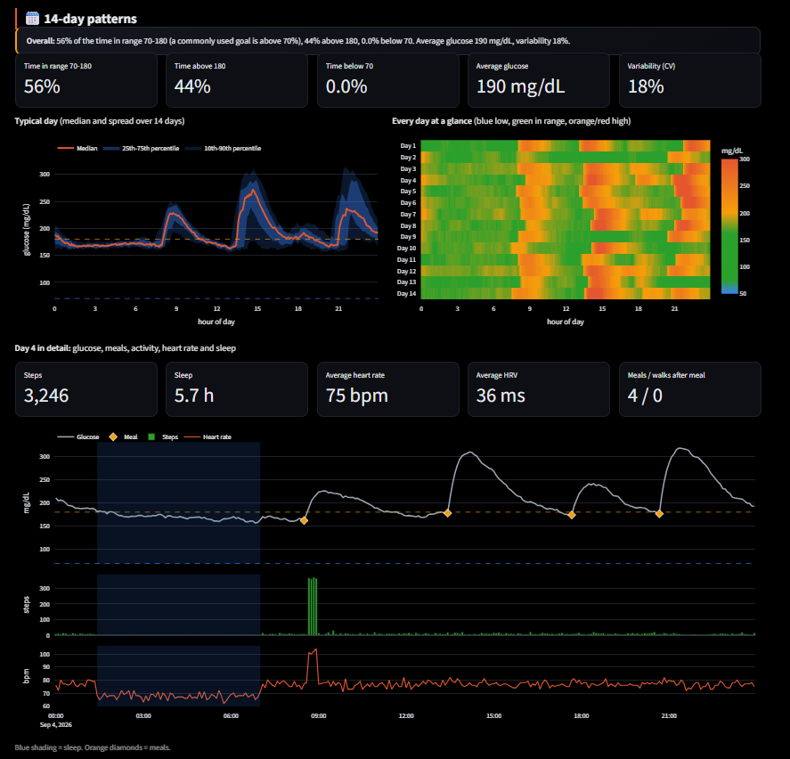

# Type 2 Diabetes Digital Twin

**Team:** bloom | **College:** Shri Shankaracharya Mahavidyalaya | **Author:** Venkatesh (solo) | **Contact:** shuklavenkatesh657@gmail.com

A proof-of-concept digital twin for **Type 2 Diabetes (T2D)**, built for the Happiest Health Digital Twin Challenge 2026. It combines a patient's health record (EHR) with a stream of wearable sensor data, forecasts glucose **2 hours ahead**, raises an alert **before** a glucose spike or a low, and lets a doctor test simple "what if" remedies.

> **Important:** This is a research prototype built on **100% synthetic data**. It is not medical advice and has not been validated on real patients.

---

## 1. The problem

People with T2D often find out about a glucose spike only after it has happened. A digital twin that is updated continuously can warn earlier and show which small change (a short walk, a smaller portion, a lower-GI swap) would help most.

- **Condition:** Type 2 Diabetes
- **Adverse event predicted:** glucose above **180 mg/dL** (high), and below **70 mg/dL** (low), up to **2 hours ahead**

## 2. What it does

| Layer | What it does | File(s) |
|---|---|---|
| 1 + 2 | Synthetic EHR and sensor generator (glucose, steps, heart rate, HRV, sleep, meals), Indian meal menu | `step1_generate_data.py` |
| 3 | Fusion LSTM: 6 hours of sensor history + the patient's EHR, predicts the next 2 hours | `step2_train_model.py`, `step3_fusion.py` |
| 4 | Adverse event alerts (HIGH > 180, LOW < 70) with precision / recall / F1 | `step4_alert.py` |
| 5 | What-if remedy engine (walk, smaller portion, low-GI swap), checked against the simulator's true answers | `step5_remedies.py`, `step6_ground_truth.py`, `step7_counterfactual.py` |
| 6 | Doctor dashboard (Streamlit) | `app_v3.py` |
| Check | 5-seed reproducibility check | `step8_seeds.py` |

## 3. Architecture



Model settings: history 72 readings (6 h), horizon 24 readings (2 h), hidden size 64, 12 epochs, seed 42.

## 4. Dashboard

Run it with `streamlit run app_v3.py`. All patients shown are synthetic, and the avatar is an illustration, not a photo.

**Live twin: forecast and alerts** (T03, day 4: 4 high-glucose alerts)



**Low-glucose alert** (T06, day 4: 12 low-glucose alerts)



**What-if remedies** (T03, a large 138 g-carb meal). This is an extreme example. The average predicted effect of walk + smaller portion across meals is about 20 mg/dL (see section 5.3).



**14-day patterns** (T03: 56% of time in range 70-180, 44% above 180, average 190 mg/dL)



## 5. Results

All results are on **10 unseen test patients (T01-T10)** that were never used in training. Training used 150 synthetic patients, 14 days each.

### 5.1 Forecast accuracy (2-hour RMSE, 5 seeds)

| Model | RMSE (mg/dL), mean ± std |
|---|---|
| Glucose-only LSTM | 18.42 ± 0.40 |
| Fusion LSTM (sensor + EHR) | 18.57 ± 0.50 |

**Honest finding:** fusion was better in only 2 of 5 seeds, and the average difference (-0.14 mg/dL) is within noise. We do **not** claim fusion improves 2-hour RMSE. Its value here is per-patient context: medicine-aware alerts and patient-specific remedy ranking.

### 5.2 Alerts (single run, 10 unseen patients)

**HIGH (> 180 mg/dL):** 1,661 new events in 10,695 windows

| Method | Precision | Recall | F1 |
|---|---|---|---|
| Trend baseline | 0.37 | 0.19 | 0.25 |
| Glucose-only LSTM | 0.76 | 0.49 | 0.59 |
| Fusion LSTM | 0.82 | 0.53 | 0.65 |
| Fusion, sensitive (margin +15) | 0.54 | 0.85 | 0.66 |

**LOW (< 70 mg/dL):** 239 new events

| Method | Precision | Recall | F1 |
|---|---|---|---|
| Fusion, default | 1.00 | 0.14 | 0.24 |
| Fusion, sensitive | 0.40 | 0.82 | 0.53 |

The default setting raised **0 false low alarms** but missed most lows. The sensitive setting catches 82% of lows at the cost of more false alarms. The dashboard defaults to the sensitive setting, because a missed low is the more dangerous mistake.

*These alert numbers come from a single run and are not seed-averaged.*

### 5.3 What-if remedies vs the simulator's true answers

| Remedy | True avg drop (mg/dL) | Predicted avg drop | Bias | MAE | Correlation |
|---|---|---|---|---|---|
| Walk 10 min | 13.23 | 14.90 | +1.67 | 2.37 | 0.96 |
| 30% smaller portion | 11.29 | 11.42 | +0.13 | 2.60 | 0.94 |
| Low-GI swap (GI 50) | 11.97 | 11.91 | -0.06 | 2.59 | 0.94 |
| Walk + smaller portion | 20.42 | 23.12 | +2.70 | 3.74 | 0.96 |

The walk effect is slightly overestimated, and the combined remedy is slightly optimistic (+2.7 mg/dL).

## 6. Limitations (please read)

1. **All data is synthetic.** The twin has never seen a real patient. Results show the pipeline works against a simulator, not that it works clinically.
2. **Remedy checks are against the same simulator** that generated the data, so they test internal consistency, not real-world physiology.
3. **Fusion gives no measurable 2-hour RMSE gain** over glucose-only (section 5.1).
4. **Walk remedy is slightly optimistic** (+1.7 mg/dL; +2.7 when combined with a smaller portion).
5. **Alert numbers are from a single run**, not averaged over seeds.
6. **Low-glucose detection** depends on the sensitivity setting; the default misses most lows.
7. The dashboard's scroll animation works in Edge and Chrome only.
8. Not a medical device. Not for clinical use.

## 7. Validation plan (next steps)

1. Test on a public real CGM dataset and report the gap between synthetic and real results.
2. Add prediction intervals and a Clarke Error Grid analysis for clinical safety of the forecasts.
3. Tune alert thresholds on a separate validation set (not the test patients).
4. Report alerts per episode and warning time, not per overlapping window.
5. Pilot with clinicians under proper ethics approval before any patient-facing use.

## 8. How to run

Tested with **Python 3.14.8** and **torch 2.14.1** on Windows.

```bash
git clone https://github.com/venkatesh-spec01/diabetes-digital-twin.git
cd diabetes-digital-twin
python -m venv venv
venv\Scripts\activate        # Windows
# source venv/bin/activate   # macOS / Linux
pip install -r requirements.txt
streamlit run app_v3.py
```

Then open `http://localhost:8501` and choose a patient (T01-T10) in the sidebar.

The generated data (`data/`) and trained models (`models/`) are included in the repository, so the dashboard runs without retraining. To regenerate everything from scratch, run the scripts in order:

```bash
python step1_generate_data.py
python step2_train_model.py
python step3_fusion.py
python step7_counterfactual.py
```

Other checks: `step4_alert.py` (alerts), `step6_ground_truth.py` (remedy validation), `step8_seeds.py` (5-seed check).

## 9. Repository layout

```
app_v3.py                  Doctor dashboard (final version)
step1_generate_data.py     Synthetic EHR + sensor data
step2_train_model.py       Glucose-only LSTM
step3_fusion.py            Fusion LSTM
step4_alert.py             Adverse event alerts
step5_remedies.py          What-if remedy engine
step6_ground_truth.py      Remedy validation vs simulator
step7_counterfactual.py    Counterfactual fine-tuning
step8_seeds.py             5-seed reproducibility check
data/  models/  plots/     Data, trained models, result plots
docs/                      Dashboard screenshots
```

## 10. Licence

MIT. See `LICENSE`.
## 11. Submission documents

- Architecture diagram: [docs/architecture_diagram.pdf](docs/architecture_diagram.pdf)
- Presentation: [docs/presentation.pdf](docs/presentation.pdf)
- Demo video: <paste your unlisted YouTube link here>
- Open-source licence: MIT, see [LICENSE](LICENSE)